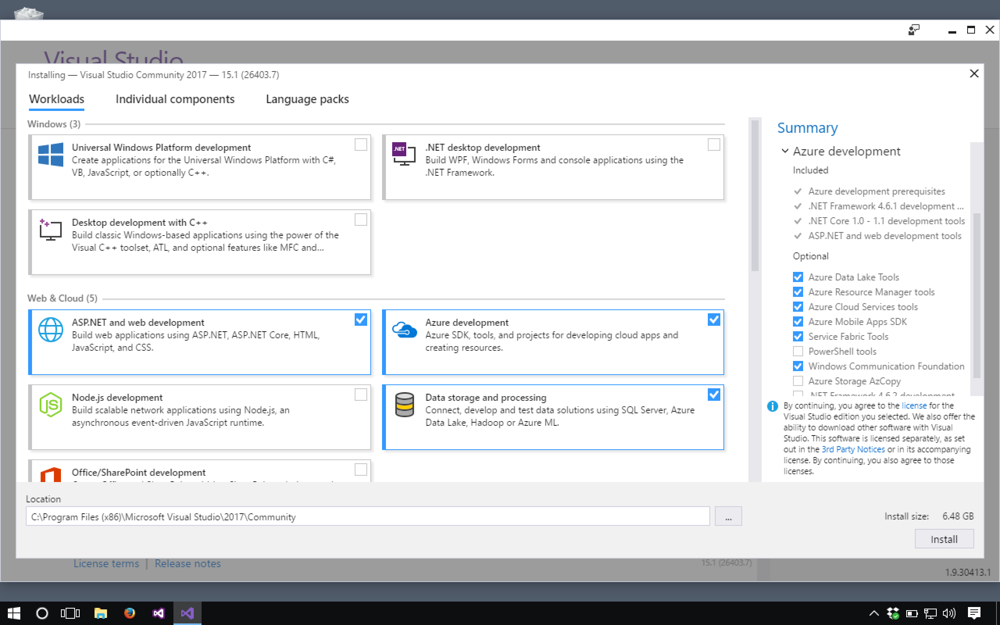
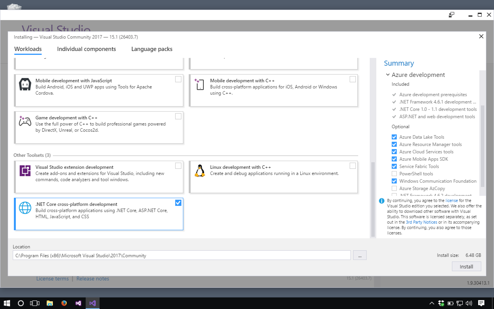

The steps here will walk you through setting up a repository that you'll use to study example code, work on studios, and complete your first assignment of this unit.

## Visual Studio

Visual Studio is the Integrated Development Environment (IDE) used to develop C# and .NET applications.

### Windows Users

Visit the [Microsoft Free Developer Apps](https://www.visualstudio.com/free-developer-offers/) page and download the Visual Studio 2017 Community installer. Allow about at least an hour for the installation process.

Run the installer, and select the following packages from the *Workloads* pane:
- ASP.NET and web development
- Azure development
- Data storage and processing
- .NET core cross-platform development

Your selections will look like these screens:

When the install finishes running, select *Launch* and then close the installer window.

When prompted, create a Microsoft Developer account and use it to sign in to Visual Studio.

The launcher window will prompt you with some choices via a window similar to what you see below. Select the displayed options.

<aside class="aside-note" markdown="1">
If you fail to install one or more of the required packages, you can do so by closing Visual Studio and running the installer again. Select *Modify* in the Visual Studio 2017 section of the window, and then select the additional package(s) to install.
</aside>

<aside class="aside-warning" markdown="1">
If you installed Visual Studio previously, ensure that you are using Visual Studio 2017. If you don't have this most recent version installed, you will need to install it via the instructions above.

If you have a pre-existing Visual Studio 2017 install, you may need to install the .NET Core Tools package. To do so, follow the [instructions provided by Microsoft](https://www.microsoft.com/net/core#windowsvs2017).
</aside>

### Mac and Linux Users

If you installed the Windows 10 development image, then you already have everything you need.

## GitHub Project Setup

Visit the [LaunchCodeEducation/csharp-exercises](https://github.com/LaunchCodeEducation/csharp-exercises) repository page and fork the repository into your own GitHub account by selecting *Fork* from the top right of the page.

After forking, open Visual Studio. From within Visual Studio, choose the *Team Explorer* tab near the bottom of the *Solution Explorer* pane. If you don't see this tab, you can open it via the application menu: *View > Team Explorer*. The first time you do this, you may need to sign in to GitHub.

Select *Clone* from the GitHub section of the *Team Explorer* and select your `csharp-exercises` copy from the modal window. **Be sure to change the Path field** to the location you would like the project to live, ideally inside of a folder you've been using to store other projects.

VM (Mac/Linux) users: Don't forget to use the `lc101` directory within your Dropbox folder for this purpose.

## Configure and test

If your solution isn't open, open it via *File > Open > Project/Solution* and browse to the `.sln` file within the `csharp-exercises` directory.

Right-click on the top-level "Solution 'csharp-exercises'" item in the *Solution Explorer* and select *Properties*. In the modal that opens, select *Common Properties > Startup Project* and then choose *Current Selection* in the pane at the right.

<aside class="aside-pro-tip" markdown="1">
This setting makes the default behavior of Visual Studio to run the currently-selected program when you hit the ▶︎ *Start* button in the toolbar.
</aside>
