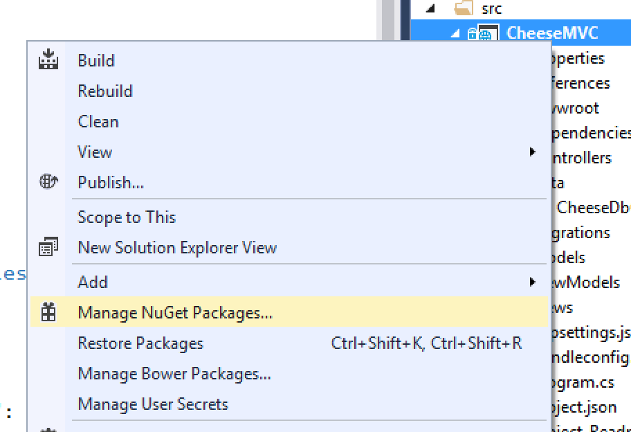
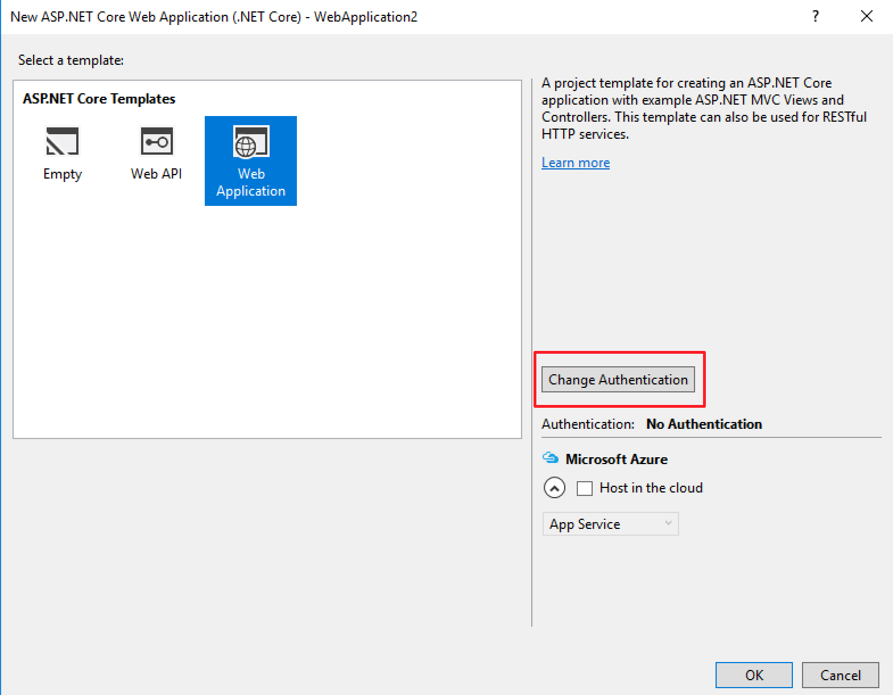
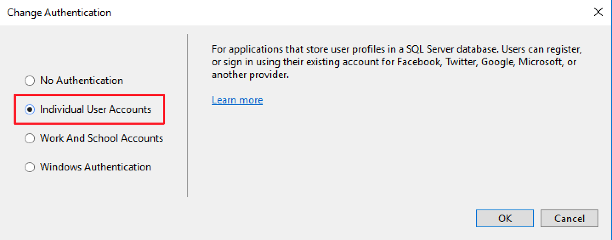

This article will show you how to enable the EntityFrameworkCore object-relational mapping framework. It assumes you are you are using **Visual Studio 2015 v14 update 3**.

<aside class="aside-warning" markdown="1">
If you try to follow along with a newer version of Visual Studio, then the package versions listed here will most likely not work for you. Additionally, you'll have problems with starter code for assignments.
</aside>

These instructions will enable EntityFrameworkCore (EF Core) for a given ASP.NET Core MVC project. You will need to follow these steps for every project you want to use EF Core with. At the bottom of this article we introduce an easier way to enable EF Core for new projects.

For the purpose of illustration, all examples will assume you're working with the `CheeseMVC` project. If you use these instructions with another project, change project names accordingly.

## Setting Up EntityFrameworkCore With an Existing App

- Open the NuGet Package Manager by right-clicking on the project name in the Solution Explorer and selecting *Manage NuGet Packages*.
    
    <aside class="aside-warning" markdown="1">
    You might be tempted carry out the updates listed in the package manager. Resist this temptation!
    </aside>
- In the *Browse* tab of the package manager, search for `Microsoft.EntityFrameworkCore.SqlServer`. Click on the matching package and select **Version 1.0.1** from the pane at right.

    
    Then hit *Install*. You'll be asked to accept the license agreement for the package, and then you'll see some console output.
- Check the *Include prerelease* box right of the search box. Then search for `Microsoft.EntityFrameworkCore.Tools`. Select the matching result and install **Version 1.0.0-preview2-final**.
    <aside class="aside-warning" markdown="1">
    One of the results of this search will be `Microsoft.EntityFrameworkCore.Tools.DotNet`. This is *not* the same package as `Microsoft.EntityFrameworkCore.Tools`. Be sure to install the correct version.
    </aside>
- In the Solution Explorer, open `appsettings.json`
    
    Add the following setting within the outer curly-braces.
    ```json
    "ConnectionStrings": {
        "DefaultConnection": "Server=(localdb)\\mssqllocaldb;Database=CheeseMVC;Trusted_Connection=True;MultipleActiveResultSets=true"
      },
    ```
    The full `appsettings.json` file will look like this:
    ```json
    {
      "ConnectionStrings": {
        "DefaultConnection": "Server=(localdb)\\mssqllocaldb;Database=CheeseMVC;Trusted_Connection=True;MultipleActiveResultSets=true"
      },
      "Logging": {
        "IncludeScopes": false,
        "LogLevel": {
          "Default": "Debug",
          "System": "Information",
          "Microsoft": "Information"
        }
      }
    }
    ```
    This sets up a connection string for a local database, [SQL Server Express LocalDB](https://docs.microsoft.com/en-us/sql/database-engine/configure-windows/sql-server-2016-express-localdb). This is a lightweight database that is useful for development. You would never use this database for an active public application (aka a "production application").
- Open `project.json`:

    
    In the `tools` section, add:
    ```json
    "Microsoft.EntityFrameworkCore.Tools": "1.0.0-preview2-final"
    ```
    The full `tools` section should look like this:
    ```json
    "tools": {
        "BundlerMinifier.Core": "2.0.238",
        "Microsoft.AspNetCore.Razor.Tools": "1.0.0-preview2-final",
        "Microsoft.AspNetCore.Server.IISIntegration.Tools": "1.0.0-preview2-final",
        "Microsoft.EntityFrameworkCore.Tools": "1.0.0-preview2-final"
      },
    ```
    This enables some command-line tools that we'll use to update databases after making changes to our model classes.


## Setting Up EntityFrameworkCore With a New App

You can create a brand new project with the above packages and settings already in place by enabling individual user accounts in the New Project dialog.

When creating a new ASP.NET Core MVC app, select *Change Authentication* in the project template screen.



In the modal that opens, select *Individual User Accounts*.



Aside from enabling a local database and EntityFrameworkCore, this also (as you might expect) enables basic user account functionality. We'll look at how to use this functionality in a future lesson.
